# SAP BTP - Hands-On Enblements Day - SAP Build Code Overview

## Description

This repository contains the material for the SLB: SAP BTP  Hands-On Enablement Day (21.02.2025).

## Overview

Introduction to SAP Build Code and how it accelerates app development with the incorporated sevices from SAP Business Technology Platform (BTP). Highlights on on key features and benefits for SAP partners and customers.
Wihin the current tutorial we will setup your SAP BTP subaccount and SAP Build Code with all the needed entitlements and permissions so that you can proceed with the actual CAP development.
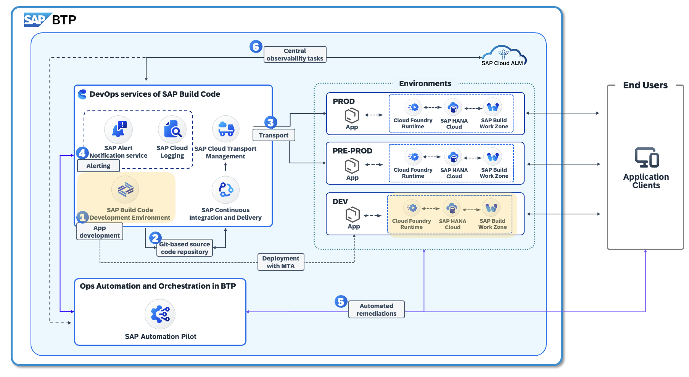

## Prerequisites

To complete the exercices in this repository, please make sure that you meet the following prerequisites:

* You have an [SAP Business Technology Platform (BTP) Trial Account](https://developers.sap.com/tutorials/hcp-create-trial-account.html).

## Create your first BTP Subaccount in your BTP Trial account

Create your first subaccount in “US East (VA) – AWS” region and click on “Create Account” button. 

You will see a that the process of creating your resources in your SAP BTP Trial account had started. 

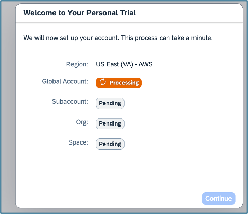

Once completed you will see the SAP BTP Cockpit welcome page. Click on “Go To Tour Trial Account” 
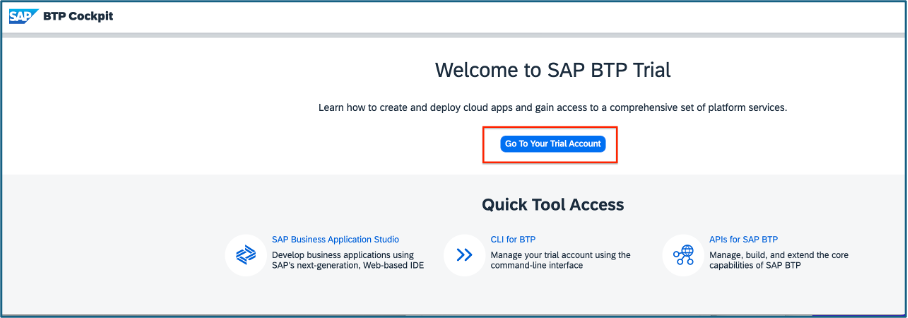

You will be redirected to your Global Account Explorer view where you also will be able to find the subaccount you just have created.

## Provision “SAP Build Code”

We’ll setup SAP Build Code using a booster. To do so, from the Global Account Explorer view, click on Boosters menu item, followed by choosing to start the booster “Get Started with SAP Build Code” (see screenshot below). 
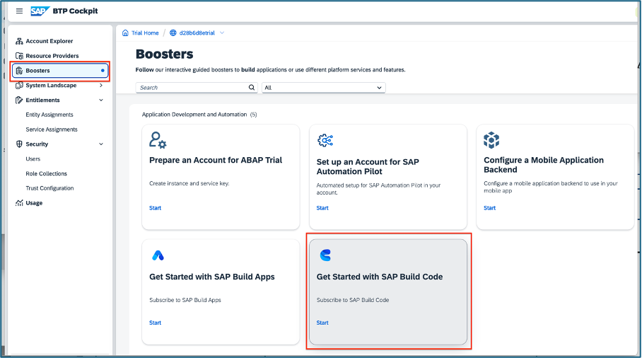

Once the booster gets loaded, click on the “Start” button. 
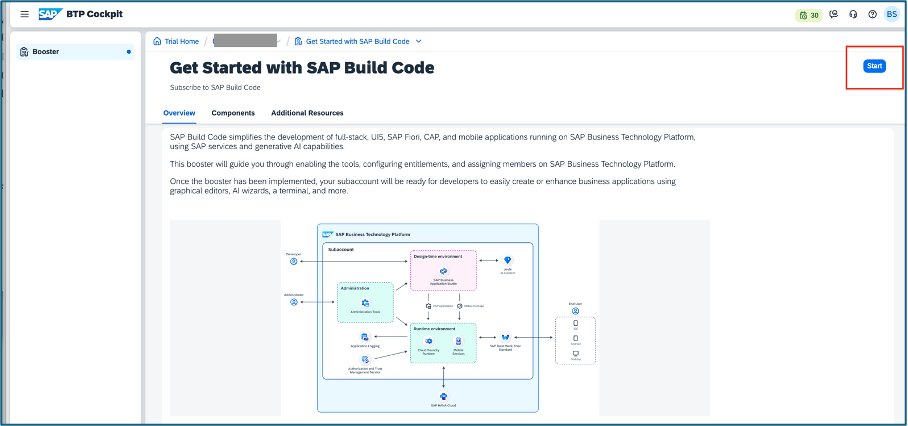

You can monitor booster’s progress at the progress popup displayed: 

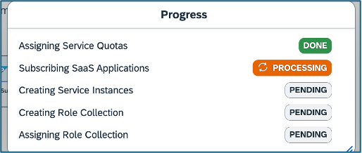

Once it is complete, click on “Navigate to Subaccount” which will direct you to the subaccount you had created. 

Congratulations – you had landed to your first subaccount in SAP BTP. 
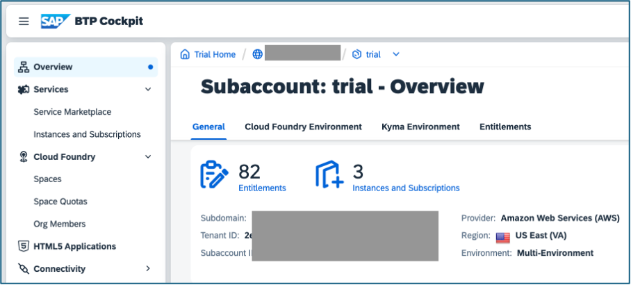

## Create a CF Space 
As a next step you will need to create a space on your CF Environment. To do so, at the subaccount overview page, just click on “Create Space” button: 

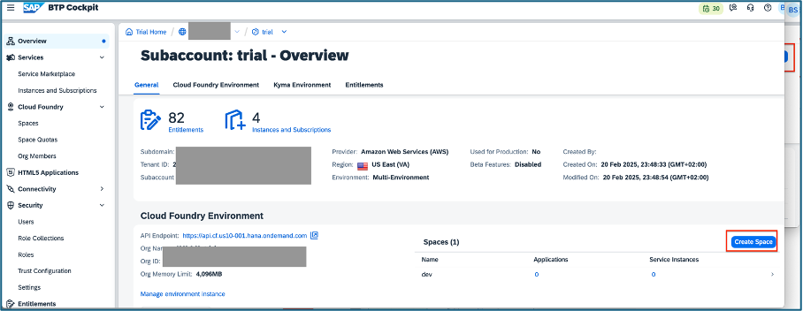

Type `dev` as a space name and click “Create” :

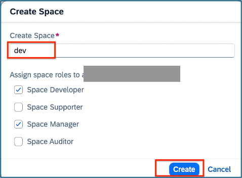

## HANA Cloud dependencies for your CAP app 
### Provision HANA Cloud, plan "tools" 

Before proceeding with the CAP application, you will need to provision few dependencies in your subaccount related to HANA Cloud. That’s needed as your CAP app will be using HANA Cloud as DB. 

To do so, go to “Instances and Subscriptions” and click on “Create” button. 

 

Within the popup screen “New Instance or Subscription”, look for: 
-	Service: `SAP HANA Cloud` 
-	Plan: `tools`

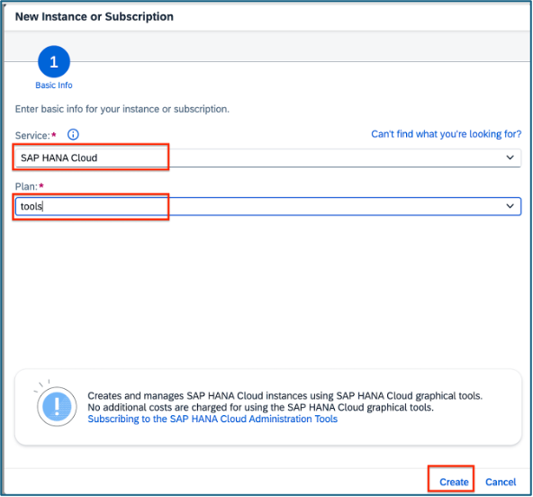

Once the process completes, you shall be able to see the subscription provisioned: 

Remember this step, you will repeat the same step along the way of setting up your subaccount with the needed resources for your development purposes. 

### Provision HANA Cloud, plan "hana" 
As a next, click over again at the “Instances and Subscriptions” menu and click on “Create” button. Within the Popup, look for 
-	Service: `SAP HANA Cloud`
-	Plan: `hana` 
See the screenshot for further reference and click on the button “Next” 
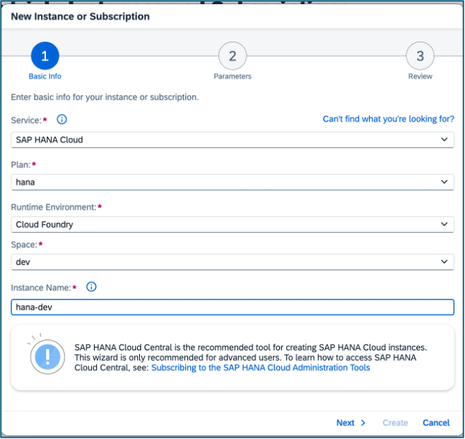

Within the parameters section, please add input for “systempassword” and click “Next” button: 

Review the inputs provided and click on “Create” 

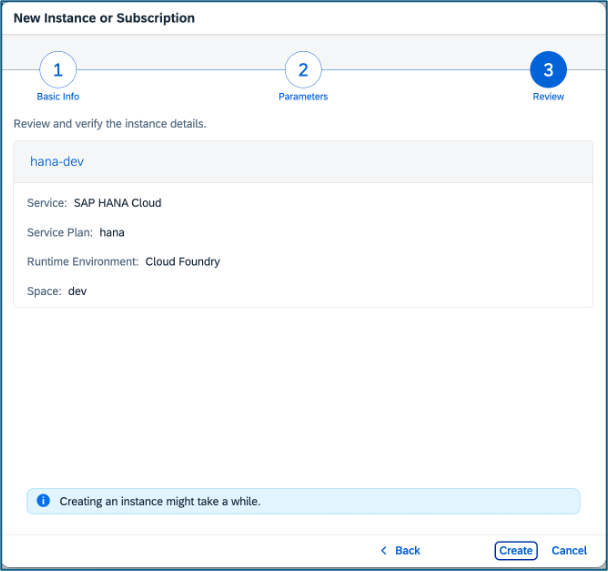

The process of provisioning HANA Cloud will take a while. To save time for our tutorial, you could proceed with another step and come back to HANA 

### Configure your HANA Cloud instance 

At this point your hana instance previously created in your **Trial** subaccount should be up and running. For the MTA Deployment Service to deploy the app and initialize the db schemas and data, the hana instance must be configured properly. First add required hana permissions.

In your **Test** subaccount in the SAP BTP cockpit, choose **Security** and **Users**.

Choose the arrow **>** next to your user entry.

In the **Role Collections** overview of your user entry, click on **Assign Role Collection** or, if the button is not visible, click the three dots (**...**) and choose **Assign Role Collection**.

Check the boxes for **SAP Hana Cloud Administrator**, **SAP Hana Cloud Security Administrator** and **SAP Hana Cloud Viewer**, then click **Assign Role Collection**.

Navigate to **Instances and Subscriptions** and click the **SAP Hana Cloud** instance to open **Hana Cloud Central**.

In **Hana Cloud Central** you should see running SAP Hana instance. Click **Manage Configuration**:

In the Manage Configuration view scroll down to **Allowed Connections** and set **Allow all IP addresses**. This setting will allow you to initialize the SAP HANA Cloud instance once deployment is started by Cloud Transport Management Service.

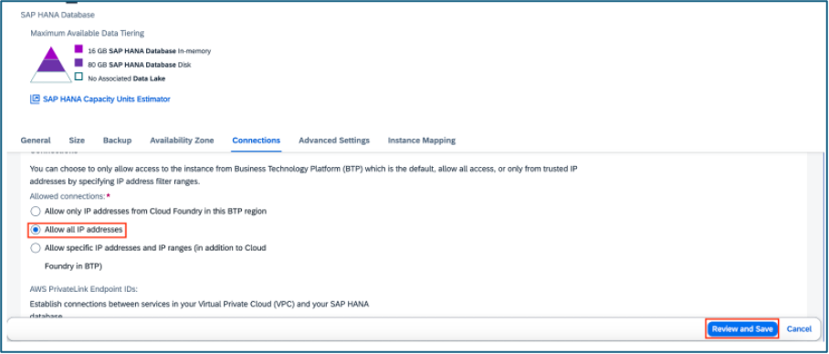

 **Apply your changes with a restart** and **save the changes**.

## Setting up Managed Application Router provided by SAP Build Work Zone, standard edition

Another dependency to you CAP app is the SAP managed app router provided by SAP Build Work Zone, standard edition. You will need it to serve the front-end of your CAP app. 

To initiate such a router in your subaccount, click on the “Instances and Subscriptions” main menu item within your subaccount, followed by the “Create” button. 

Provision a subscription of SAP Build Work Zone, standard edition and click the “Create” button. 

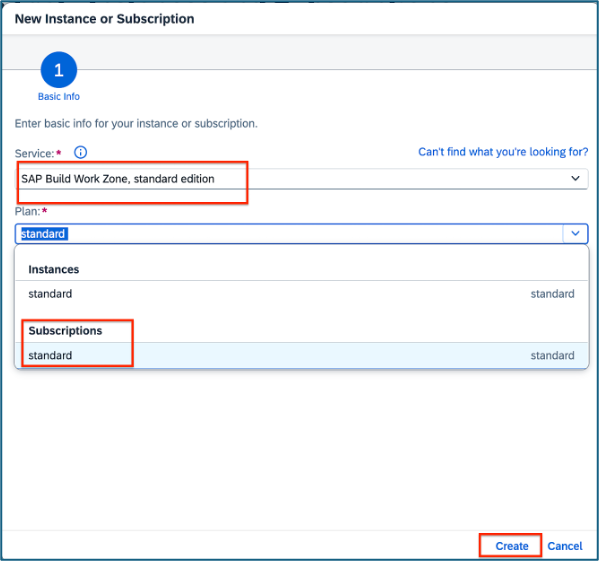

## Assigning role collections to your user on subaccount level

By this moment you should have these subscriptions and services available in your subaccount: 
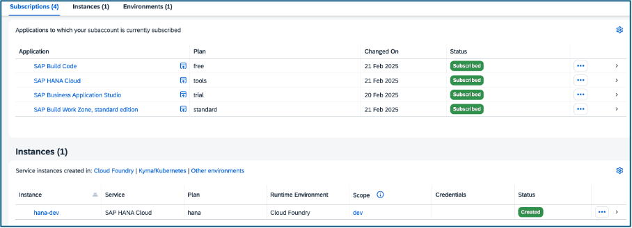

Before proceeding with the development, make sure you have all the needed permissions. To do so, in your subaccount in the SAP BTP cockpit, choose **Security** and **Users**.

Choose the arrow **>** next to your user entry.
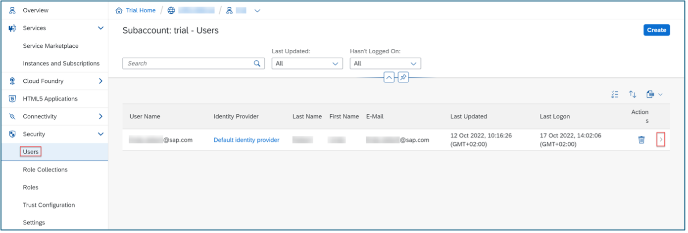

In the **Role Collections** overview of your user entry, click on **Assign Role Collection** or, if the button is not visible, click the three dots (**...**) and choose **Assign Role Collection**.

Check all the boxes and save the configuration. 

## Summary
Now you are all set to proceed with the next steps , please see [Cloud App Development with SAP Business Application Studio](https://github.com/bisinho/Enablement-Day-Guides/tree/main/2%20-%20Cloud%20App%20Development%20with%20SAP%20Business%20Application%20Studio)

